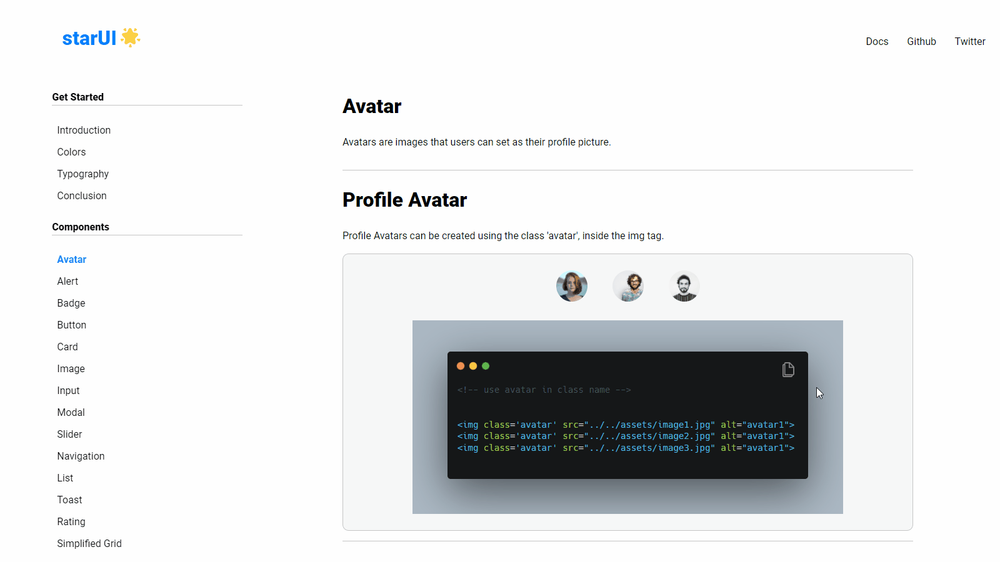
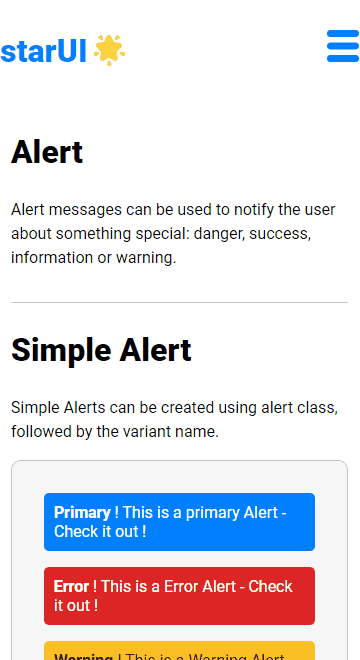

# starUI-component-library

### starUI is a free, open-source framework that provides ready-to-use frontend components that you can easily combine to build responsive interface.

[](https://wakatime.com/badge/user/1773f973-ffcf-4a9c-b61a-8e4fdc1ecf3e/project/97b2d7a5-9e1e-4d27-87e4-2fa0333a078a)


# Installation

```html
<link
  rel="stylesheet"
  href="https://starui-component-library.netlify.app/index.css"
/>
```

# Table of Contents

- [Avatar](https://starui-component-library.netlify.app/pages/avatar/avatar.html)
- [Alert](https://starui-component-library.netlify.app/pages/alert/alert.html)
- [Badge](https://starui-component-library.netlify.app/pages/badge/badge.html)
- [Button](https://starui-component-library.netlify.app/pages/button/button.html)
- [Card](https://starui-component-library.netlify.app/pages/cards/cards.html) &emsp;&emsp;&emsp;&emsp; **_requires JS_**
- [Image](https://starui-component-library.netlify.app/pages/image/image.html)
- [Input](https://starui-component-library.netlify.app/pages/input/input.html)
- [Modal](https://starui-component-library.netlify.app/pages/modal/modal.html)&emsp;&emsp;&emsp;&emsp;**_requires JS_**
- [Slider](https://starui-component-library.netlify.app/pages/slider/slider.html)
- [Navigation](https://starui-component-library.netlify.app/pages/navigation/navigation.html)&emsp;&emsp;**_requires JS_**
- [List](https://starui-component-library.netlify.app/pages/list/list.html)
- [Toast](https://starui-component-library.netlify.app/pages/toast/toast.html) &emsp;&emsp;&emsp;&emsp; **_requires JS_**
- [Rating](https://starui-component-library.netlify.app/pages/rating/rating.html)
- [Simplified Grid](https://starui-component-library.netlify.app/pages/grid/grid.html)

# Quick Start

## Clone the repository

- Using git bash : `git clone https://github.com/Kevin-Solomon/starUI-component-library.git`

# Issue Reporting

Encountered a bug or do you need a need a feature request ? Please to do check the issues tab on the repo if your issue / request does not exist , [open a new issue](https://github.com/Kevin-Solomon/starUI-component-library/issues/new)

**_If you have encountered a bug a before and after picture of the bug would be very helpful or if time permits a small video of the bug would greatly help us undertand the issue._**

# 👨‍💻 Connect with me

<a href="https://twitter.com/kevinsolomon777"></a>
<a href="https://www.linkedin.com/in/kevin-solomon-8b2b2b1a5/"></a>

# Desktop Version



# Mobile Version


